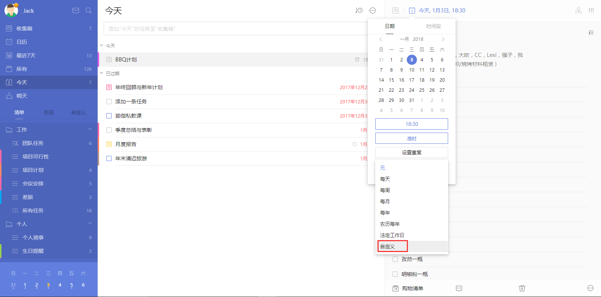
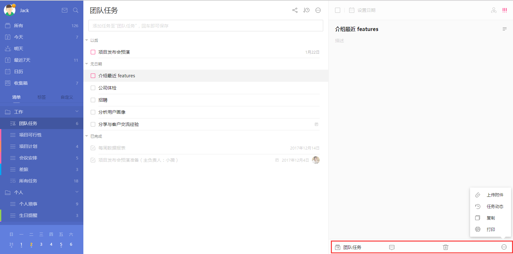
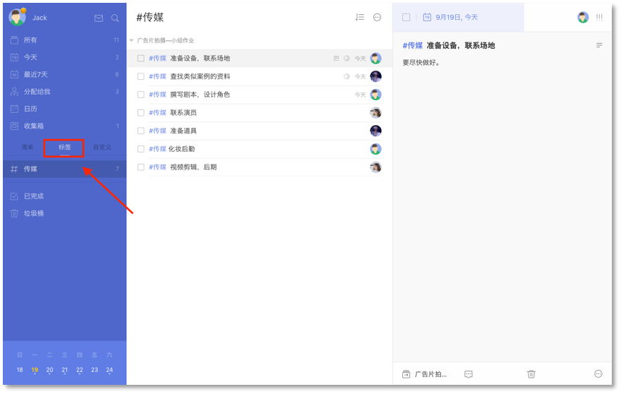

##任务创建以及管理

####创建新任务

#####任务添加栏添加任务

在任务列表页顶部的输入栏输入任务内容, 按回车键即创建成功。
任务会保存在选中的对应列表中；在清单中创建任务会保存在当前清单中；在智能清单中添加任务，若没有选中列表,则任务默认保存在【收集箱】中。

* 在输入栏内输入「#」，可以为任务指定标签；
* 在输入栏内输入「^」，可以将任务添加到指定清单；
* 在输入栏内输入「*」，可以快速为添加的任务设置日期；
* 在输入栏内输入「!」，可以快速为添加的任务设置日期；
* 智能识别日期：在输入栏内输入任务，文本中的日期和时间显示高亮，将自动为任务设定到期日和提醒时间。
  `注：进入【设置】-【偏好设置】即可开启智能识别日期。`
 `注：不想显示文本中的日期和时间，可在【设置】-【偏好设置】-【智能识别日期】下选择【移除文本中的日期】。点击高亮的识别日期也可以取消识别。在添加时会把新任务默认设置带上，根据自己的需要在【设置】-【偏好设置】-【新任务默认设置】中进行设置。`

#####快速添加任务

可以使用快捷键调出任务添加栏，快速添加任务。创建任务的快捷键可以查看头像-【设置】-【快捷键】。

#####回车添加任务

在任务列表页上，选中某条任务，光标定位在任务最后，键盘点击回车，输入任务标题可以创建新任务。在已完成中回车可以创建新的已完成任务。不同排序下回车创建的任务带上的设置不同。比如：在按时间排序下，“今天”清单下中回车创建的任务会带上今天的时间；在按优先级排序下，回车创建的任务会带上原优先级。

#####批量添加任务

把多行（含回车符号）的文本复制粘贴到添加栏时，会弹窗提示是否需要同时添加多个任务，选择【添加】会同时添加多个任务到该清单；选择【取消】，每一行的文字会以空格间隔形成一个任务标题，可回车添加。
比如复制的文本如下：
和同学聚餐
看电影
晚上8点去图书馆
复制粘贴到添加栏时，选择批量添加任务，该清单中就添加了三条任务。
`注:智能识别开启，若批量添加的任务标题中含有时间信息也会被识别。`

#####通过邮件添加任务

除了直接在网页端添加任务，你也可以通过邮件创建任务。
 点击左上角头像-【设置】-【日历订阅&邮件】,使用您在滴答清单上注册的邮箱，直接将任务发送至 [todo@mail.dida365.com](todo@mail.dida365.com) ， 任务即自动生成。
 同时可以在邮件标题中加入时间信息如X月X日，来快速设定任务到期时间。
 点击左上角头像-【设置】-【日历订阅&邮件】，您也可以查看系统自动生成的专属邮件地址, 您只需要直接在邮件标题中将任务内容写入, 通过任意邮箱发送到该地址, 任务便会自动创建。

点击重置, 会生成一个新的邮件地址。

####设置提醒
若您在创建任务的时候并未输入任务到期时间，那么您可以点击任务进入右侧详情页，单击日期栏为任务设置到期时间。
 设置好到期时间后，可以为任务设置提醒。
 如果担心一次提醒容易错过，可以设置多次提醒。
 如果默认提醒中没有你需要的提醒时间，可以点击【自定义】按钮，支持以【分钟】【小时】【天】为单位设置您所需要的提醒。
  `注：免费用户可为单条任务设置两个提醒，高级账户最多可设置五个提醒。`

####设置重复
如果你需要做一些按周期循环的事情，比如每月15号查看信用卡账单，可以创建重复任务。
 点击日期栏，单击【设置重复】。
 支持【每天】、【每周】、【每月】、【每年】、【农历每年】、【法定节假日】重复；点击自定义, 可以更为个性化的设置重复，例如【每周二】或【每个月的第三个周五】。
 目前支持【到期重复】和【完成重复】两种重复模式。
  `注：到期重复：任务按日期重复，小明需要每周五下午安排下周工作，所以设置一个每周五下午都会提醒的到期重复；`
  `注：完成重复：任务按周期重复，小明想要每三天去一次健身房跑步，这一次是星期二，那么下一次会在星期五提醒他；但他星期五没有去，在星期日完成了这个任务，那么下一次的提醒时间是星期三，而不是星期一。`
 设定好重复后，可以继续为任务设定结束重复的时间，重复任务默认为【一直重复】，可以设置为【按日期结束】，然后选择你需要的结束时间。

####时间段任务

有些事情10分钟以内就能搞定，但有些事情需要持续1小时甚至几天。在日期选择框中切换到【时间段】，可以选择开始时间和结束时间，设置跨天的任务。跨天任务也可以设置提醒，提醒是根据开始时间设置的。
在任务列表的添加栏中，可以识别时间段，比如“2/19-2/22 旅游”，时间段信息是可以识别的。

####修改任务
任务的时间产生变更，或内容需要更改，可以直接在右侧任务详情页进行编辑。

任务详情页右上角，分别有【指派】和【优先级】按钮：
* 【指派】：可以将该任务指派给共享清单中的成员，包括自己；
 `注：该任务不属于共享清单时，不显示【指派】按钮。`
* 【优先级】：包括【高】【中】【低】【无】四种优先级。

 任务详情页下端，分别有【所属清单】【评论】【垃圾桶】【更多】。
* 点击【所属清单】，可以快速将任务移动到某个清单；
* 点击【评论】，可以对任务增加评论；若是共享任务，还可以@他人或回复他人，对方会在通知中心收到提醒；
* 点击【垃圾桶】，任务会被删除，若误删，可以点击弹出的提示中【撤销】按钮来恢复任务，也可以去侧边栏上的垃圾桶中恢复；
* 【更多】中包括：
 1、【上传附件】：滴答清单支持拍照、相册中的照片，音频和经常使用的文件类型如 word,excel 等。
  `注：免费用户一天可上传一个附件，高级账户一天可上传99个附件。`
 2、【任务动态】：你可以在这里看到此任务的历史动态，包括创建、修改、完成等。
  `注：【任务动态】为高级账户功能。`
 3、【复制】：你可以复制此任务，并快速创建一个新任务。
  `注：该功能要去【设置】-【实验功能】中开启，才会显示在更多中。`
 4、【打印】：可以将此任务的任务详情打印出来。

####创建列表任务

成功创建任务后，右侧任务详情界面，点击任务右侧的【文本】按钮，可以将文本模式转为列表模式。
列表任务一般用来添加子任务，如购物清单；也可以将大任务拆分成小任务或具体步骤。
回车即可添加下一条子任务，可以对子任务进行修改，回退删除和点击后面的垃圾桶图标进行删除。

####子任务描述

列表任务时，任务描述可以和子任务共存，描述可以记录备注，方便了解当前事件的状况。

####子任务提醒

列表任务中，可以给每个子任务设置提醒，明确每一个执行步骤的截止日期，不错过任何小事件。

有时间的子任务提醒时间就是所设置的时间，只有日期没有时间的子任务的提醒时间是根据每日提醒的时间提醒。

有时间信息的子任务会显示在今天、明天、最近7天、日历和带有时间的自定义智能清单中。子任务默认是隐藏的，需要开启时，点击右上角的【...】，选择【显示子任务】，子任务就会显示在列表中。按时间排序时，子任务、任务和日历事件是根据时间混排的。
`注：该功能为高级账户功能。`

 点击重置, 会生成一个新的邮件地址。

####指派任务给其他人
你只能在与他人共享的清单里指派任务。
 点击任务详情界面的指派图标，选择你要指派的对象。被指派者会在应用内收到通知。

####添加标签
为任务添加标签可以更方便的对任务进行分类管理。
 左上角头像-【设置】-【智能清单】，打开【分类标签】的开关，然后清单栏就会出现标签。

 给任务添加列表只需要您在需要标注的词语或者字前加 「#」即可: 比如「#重要工作」，需要注意的是，标签前后需要留有一个空格。
 您可以给一个任务添加最多五个标签; 当点击标签时, 所有被打上该标签的任务都会显示出来。
  `注：没有未完成任务的标签将不再显示在标签栏下。`

####搜索任务
【搜索】的图标在左侧面板的顶部。利用搜索功能，可以对任务进行全局搜索。

  `注：搜索结果包括已完成和未完成，可以自行设定搜索的条件：日期、清单和任务状态。`

####任务进度
进入任务详情页，光标放在日期栏下划线处，日期栏会显示进度条百分比，单击即可设定。任务打钩完成时，进度条会向右侧自动跳满。

