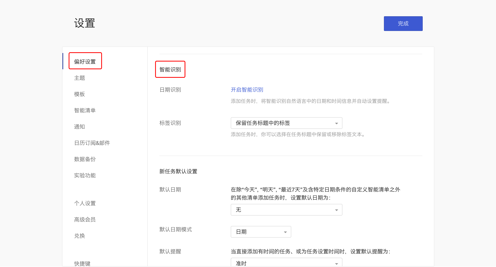

## 基础设置

### 偏好设置

点击左上角头像-「设置」-「偏好设置」，可以根据您的使用偏好来对语言、日期&时间、智能识别和新任务默认设置等进行设置。

**语言**
* 语言：在下拉框中选择语言；

**日期&时间**
* 时间格式：可以选择12小时制或24小时制；

* 每周开始于：支持设置每周开始于周日/周一/周六；

* 已过期任务位置：可以选择放在清单顶部或清单底部；

* 每日提醒时间：打开每日提醒开关后，可以自行设定每一天的提醒时间，所有逾期任务和今天任务将在该时间进行提醒；
	
* 网页提醒：可以选择是否在网页端进行任务提醒；

* 农历、周数、节假日：可选择是否在日历中显示农历、周数和节假日；

* 倒数日模式：启用后，清单内各任务右侧的日期，将显示为倒数日，可以点击任务右侧的倒数日或日期进行切换；

* 时区：启用后，在设置时间时可以选择时区。

**智能识别**

* 日期识别：添加任务时，将智能识别自然语言中的日期和时间并自动设置提醒。

* 标签识别：添加任务时，你可以选择在任务标题中保留或移除标签文本。

**新任务默认设置**

您可以根据需要对新任务的日期、日期模式、提醒、优先级和添加到清单的位置进行默认设置，之后添加的新任务会自动带上这些默认设置。
 `注：智能清单“今天”、“明天”、“最近7天”以及带日期的自定义智能清单不受默认日期的影响。`

### 主题

点击左上角头像 -「设置」-「主题」，滴答清单 Web 端提供了 4 种纯色主题，12 种城市系列主题和 4 种季节系列主题，可以根据喜好选择主题。

### 模板
开启后，您可以进入任务详情，点击右下角「···」菜单，选择将任务保存为模板。以后添加任务时即可选择从模板添加。

### 实验功能

#### 复制任务

打开「复制任务」功能后，可以在任务列表页和任务详情页这种对所选任务进行复制。

#### Mini 日历

打开「Mini日历」后，可以在主页左下角看到 Mini 日历，可以通过 Mini 日历快速查看日程。

#### 番茄计时

打开「番茄计时」后，可以在主页左下角显示**开始专注**小窗口。

#### 打卡

打开「打卡」后，当左侧边栏底部显示**打卡**按钮，点击可以进入打卡界面。

