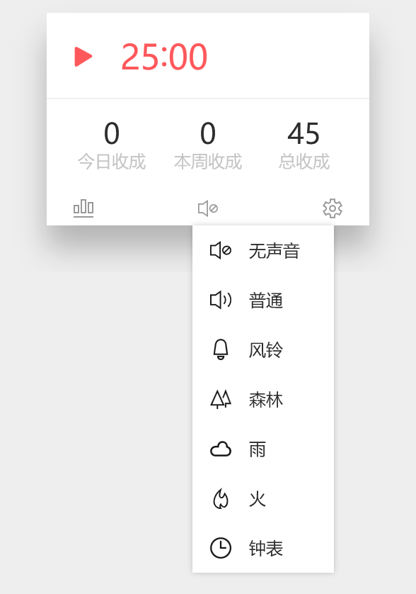

####窗口操作

鼠标移动到番茄右上角，会出现四个相关操作：
【置顶】，打开之后，番茄记时窗口会一直显示在最上方，如果需要取消置顶，再次点击即可；
【最小化】，点击之后，窗口会最小化，需要打开的时候，可以再次使用快捷键 Ctrl + Shift + P 打开；
【详细】，点击会展开详细窗口；
【关闭】，点击会关闭番茄记时窗口。

####详细操作

打开详细模式之后，下方有三个操作选项；
【统计】打开番茄统计窗口；
【音效】选择对应的白噪音音效；
【设置】打开番茄记时相关设置。

